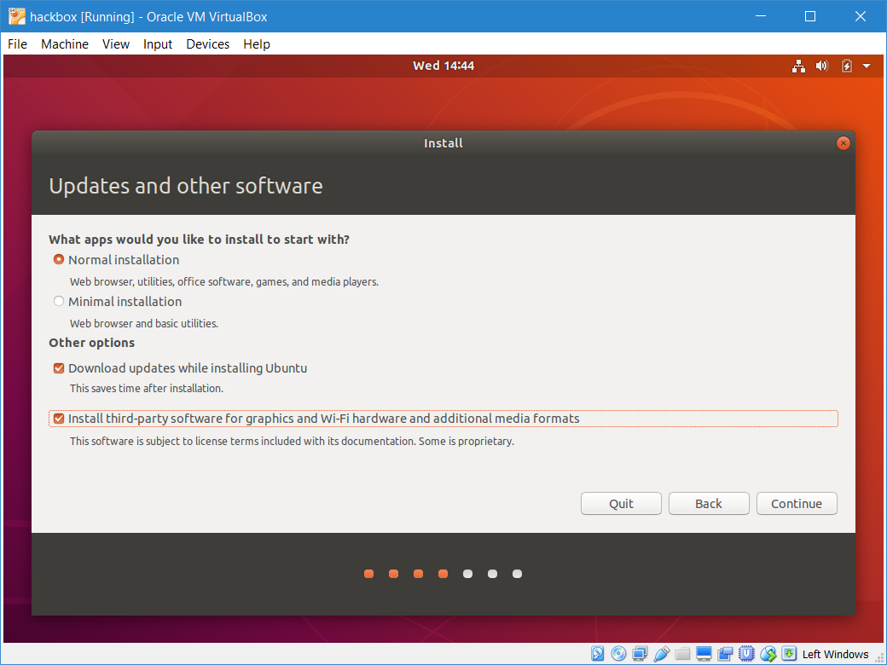

# setup
Recommended setup file for new members

1. Get [Ubuntu 18.04 ISO]( https://www.ubuntu.com/download/desktop) 
2. Install [VirtualBox](https://www.virtualbox.org/wiki/Downloads)
3. Open VirtualBox
4. Press ```New``` on the top left
5. Create ```Linux``` , ```Ubuntu``` (usually 64-bit) Virtual Machine. Name it to your choice.

6. Click next, set Memory Size to a minimum of ```2048MB```
7. Click next, then Create (when it asks for creating visual hard disk)
9. Choose ```VMDK``` (just in case you start hating VirtualBox)

10. Click next, choose ```Dynamically Allocated```
11. Change the virtual hard disk size if you plan on installing anything large in the near future. Otherwise, ```10GB``` should be enough.
12. Right-click on the newly created VM, go to Settings

13. Click on Storage on the left panel

14. Click on ```Empty``` below ```Controller: IDE```

15. There is a CD icon on the right, next to the combobox. Click on it and browse to where the downloaded Ubuntu .iso file is
16. Click on ```System``` on the left panel, then the ```Processor``` tab. Increase the settings there to however large your system can spare.

16. Click OK, then Start the VM by clicking on the big green Start arrow. This should be the result

17. Click ```Install Ubuntu```
- A tip: To change control back to your host OS, press ```Ctrl```, or the Windows ```Start``` button/ MacOS ```Cmd``` button
18. Choose your appropriate keyboard layout, click next
19. Check the ```Install third-party updates...``` checkbox

20. Click on Install Now (there is nothing in the disk to be erased ;) 

21. Choose your timezone, click Continue.
22. Select your user settings, click on Continue
23. Wait for Ubuntu to install. The installation might ask for a restart periodically. Press yes accordingly.
24. Login to the VM, open a terminal (```Ctrl-Alt-T```) type in  ```sudo apt-get install virtualbox-guest-dkms virtualbox-guest-utils virtualbox-guest-x11``` and press enter. This is to make sure VirtualBox is kind to you
25. Enable shared clipboard by clicking on Devices>Shared Clipboard>Bidirectional, and Devices>Drag and Drop>Bidirectional

26. Setup Shared Folders via Devices>Shared Folder>Shared Folders Settings

27. Click on the + folder sign when the popup opens

28. Enter your preferred folder, click on ```Make Permanent``` and ```Auto-mount```
29. Click on Ok, then restart the VM
30. The Shared Folder is on the path /media/sf_FOLDERNAME, where FOLDERNAME is the name of the folder that you chose, and will also be on the Desktop.
31. Open a terminal, enter ```sh -c "$(wget https://raw.githubusercontent.com/nush-osi-layer-8/setup/master/bootstrap.sh -O -)"```